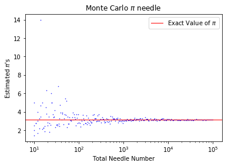
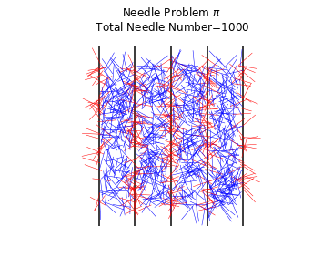

```python
import numpy as np
import matplotlib.pyplot as plt
import matplotlib.lines as lines
%matplotlib inline
```


```python
def est_pi(n,l,d): #l must be less than d
    c=np.random.rand(n) #distance between one line and the needle center
    t=np.pi*np.random.rand(n) #vertical angle between 0 and pi
    n_intersect=0
    i=1
    while i<=n:
        if 0.5*l*np.sin(t[i-1])>=c[i-1] or 0.5*l*np.sin(t[i-1])>=d-c[i-1]: #check if needle intersects lines
            n_intersect=n_intersect+1
        i=i+1
    return 2.*l/d*n/n_intersect
```


```python
min_needle=10
max_needle=10**5
total_dif_points=300 #number of different points from min_needle to max_needle
d=2    #distance between lines
l=1    #needle length !! must be less than d !!

fig,mc=plt.subplots()
mc.set(xlabel="Total Needle Number",ylabel="Estimated $\pi$'s",
       title="Monte Carlo $\pi$ needle ",xscale="log")

for needle_no in np.geomspace(min_needle, max_needle, num=total_dif_points, dtype=int): #estimate pi from min to max at total_dif_points different points
    mc.scatter(needle_no,est_pi(needle_no,l,d),marker=".",c="b",s=1)

mc.axhline(np.pi,c="r",label="Exact Value of $\pi$",linewidth=1) #exact value of pi in Python Numpy
mc.legend()

fig.savefig("monte_carlo_pi_needle_graph.png",dpi=1000)
```





```python
#needle problem drawing
fig,mc_2=plt.subplots()
mc_2.set(title="Needle Problem $\pi$ \n Total Needle Number=$1000$ ",xlim=[0,8],ylim=[0,8])
mc_2.axis("off")
mc_2.axis('equal')

needle_number=10**3
init_coor=8*np.random.rand(needle_number,2) #needles inside 8x8 square with left lower edge at (0,0)
theta=np.random.rand(needle_number)*2*np.pi
fin_coor=np.column_stack((init_coor[:,0]+np.cos(theta),init_coor[:,1]+np.sin(theta)))

for i in range(0,9,2): 
    mc_2.vlines(i,-1,9) #line height 1 unit longer from both top and bottom edges
for i in range(0,needle_number): #check intersecting needles and draw
    if init_coor[i,0]<=0<=fin_coor[i,0] or fin_coor[i,0]<=0<=init_coor[i,0]:
        mc_2.add_line(lines.Line2D([init_coor[i,0],fin_coor[i,0]],[init_coor[i,1],fin_coor[i,1]],c="r",linewidth=0.5))
    elif init_coor[i,0]<=2<=fin_coor[i,0] or fin_coor[i,0]<=2<=init_coor[i,0]:
        mc_2.add_line(lines.Line2D([init_coor[i,0],fin_coor[i,0]],[init_coor[i,1],fin_coor[i,1]],c="r",linewidth=0.5))
    elif init_coor[i,0]<=4<=fin_coor[i,0] or fin_coor[i,0]<=4<=init_coor[i,0]:
        mc_2.add_line(lines.Line2D([init_coor[i,0],fin_coor[i,0]],[init_coor[i,1],fin_coor[i,1]],c="r",linewidth=0.5))
    elif init_coor[i,0]<=6<=fin_coor[i,0] or fin_coor[i,0]<=6<=init_coor[i,0]:
        mc_2.add_line(lines.Line2D([init_coor[i,0],fin_coor[i,0]],[init_coor[i,1],fin_coor[i,1]],c="r",linewidth=0.5))
    elif init_coor[i,0]<=8<=fin_coor[i,0] or fin_coor[i,0]<=8<=init_coor[i,0]:
        mc_2.add_line(lines.Line2D([init_coor[i,0],fin_coor[i,0]],[init_coor[i,1],fin_coor[i,1]],c="r",linewidth=0.5))
    else:
        mc_2.add_line(lines.Line2D([init_coor[i,0],fin_coor[i,0]],[init_coor[i,1],fin_coor[i,1]],c="b",linewidth=0.5))

fig.savefig("monte_carlo_pi_needle_drawing.png",dpi=1000)
```




